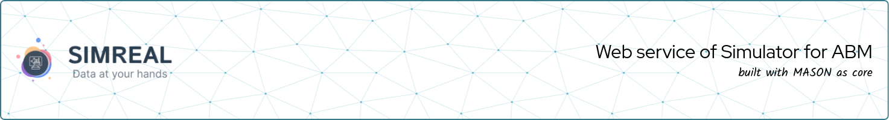
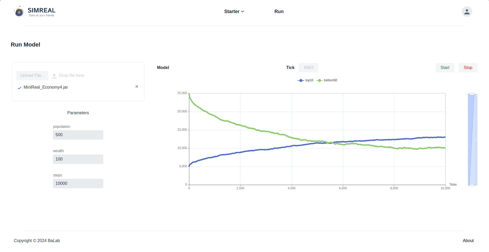

# WebService of Simulator for Agent-based Modeling
## (WSim4ABM or MiniReal)
> This is a WebService implementation for an Agent-based Modeling Simulator, shortly called WSim4ABM or MiniReal.
> This opensource project houses remote access to High Performance Computing (HPC) resources through 
> browser based visualization for ABM simulations along with other services.

## Introduction
**WSim4ABM** (MiniReal) is a web-based simulation platform for Agent-Based Modeling (ABM), built on top of the **MASON** simulation 
library for its extensibility, flexibility, and compatibility with Java ecosystems. The platform enables users to 
create, configure, and run ABM simulations seamlessly, both locally and on remote HPC resources. Key features include:

- **Web Interface and User Management**: Supports account management and secure access.
- **ABM Development Workflow**: Users can download sample ABM templates, develop simulations locally, and export them 
as runnable JAR files via **Gradle**.
- **Remote Simulation Execution**: Supports uploading and running simulations on remote HPC resources with real-time 
output visualization, including interactive charts.
- **Dynamic Parameter Configuration**: Allows users to adjust model parameters directly from the web interface without 
code modifications, using custom annotations and a dedicated annotation processor.
- **Robust Communication**: Utilizes Message Broker middleware to ensure stability and scalability in interactions 
between the simulation engine and the User Interface.
- **Dockerized Deployment**: The entire system is containerized for streamlined deployment on HPC environments.

WSim4ABM provides an end-to-end solution for developing, running, and visualizing ABM simulations, enhancing 
accessibility and scalability for researchers and developers.

## Requirements  (Prerequisites)
The requirements to deploying and utilizing the MiniReal system and workflow are:

- [Docker]()
- [Java]()
- Integrated Development Environment (IDE), preferably [Intellij]() for the system was heavily tested on it
- Web Browser

## Tech Stack / Built With
The technology / frameworks / tools used in this project are:
1. [Vaadin](https://vaadin.com/) -
2. [Spring Boot](https://spring.io/projects/spring-boot) -
3. [PostGREs](https://hub.docker.com/_/postgres) -
4. [Apache Kafka](https://hub.docker.com/r/confluentinc/cp-kafka) -
5. [MASON](https://cs.gmu.edu/~eclab/projects/mason/) -
6. [MiniReal Annotation Library](https://central.sonatype.com/artifact/io.github.panderior/minireal-annotation) -
7. [Gradle](https://gradle.org/) -
8. [Maven](https://maven.apache.org/) -

## Documentation
The full documentation for this project can be found on the following site.
* https://minireal-doc.pazd.org

## Deployment of WSim4ABM

## How to Contribute
Contributions are welcome. For significant modifications, please initiate a discussion by opening an issue first.
Ensure that tests are updated as necessary. To contribute, please fork the repository and make your changes accordingly.
Pull requests are warmly welcomed.

**Steps to Contribute:**
1. Fork this repository.
2. Create a feature branch (`git checkout -b feature/fooBar`).
3. Commit your changes (`git commit -am 'Add some fooBar'`).
4. Push to the branch (`git push origin feature/fooBar`).
5. Submit a new Pull Request.

Refer to CONTRIBUTING.md for details on our code of conduct and the submission process for pull requests.

## License
This opensource project is licensed under Apache 2.0 license. For more details please refer to the [LICENSE](./LICENSE.md)
file.