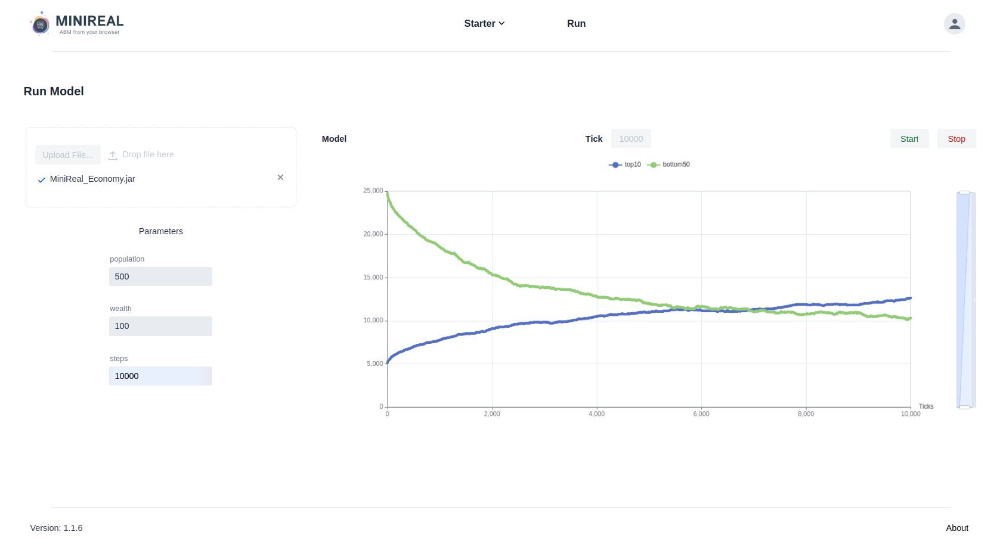

<p align="center">
    
    
    
</p>

# WebService of Simulator for Agent-based Modeling
## (WSim4ABM or MiniReal)
> This is a WebService implementation for an Agent-based Modeling Simulator, shortly called WSim4ABM or MiniReal.
> This opensource project houses remote access to High Performance Computing (HPC) resources through 
> browser based visualization for ABM simulations along with other services.

<p align="center">
  <a href="https://minireal-doc.pazd.org">Documentation</a> &nbsp; <a href="https://www.sciencedirect.com/science/article/pii/S2352711025001402">Paper</a>
</p>


---
## Introduction
**WSim4ABM** (MiniReal) is a web-based simulation platform for Agent-Based Modeling (ABM), built on top of the **MASON** simulation 
library for its extensibility, flexibility, and compatibility with Java ecosystems. The platform enables users to 
create, configure, and run ABM simulations seamlessly, both locally and on remote HPC resources. Key features include:

- **Web Interface and User Management**: Supports account management and secure access.
- **ABM Development Workflow**: Users can download sample ABM templates, develop simulations locally, and export them 
as runnable JAR files via **Gradle**.
- **Remote Simulation Execution**: Supports uploading and running simulations on remote HPC resources with real-time 
output visualization, including interactive charts.
- **Dynamic Parameter Configuration**: Allows users to adjust model parameters directly from the web interface without 
code modifications, using custom annotations and a dedicated annotation processor ([MiniReal Annotation library](https://central.sonatype.com/artifact/io.github.panderior/minireal-annotation)).
- **Robust Communication**: Utilizes Message Broker middleware to ensure stability and scalability in interactions 
between the simulation engine and the User Interface.
- **Dockerized Deployment**: The entire system is containerized for streamlined deployment on HPC environments.

WSim4ABM provides an end-to-end solution for developing, running, and visualizing ABM simulations, enhancing 
accessibility and scalability for researchers and developers.



---
## Requirements  (Prerequisites)
The requirements to deploying and utilizing the MiniReal system and workflow are:

- [Docker](https://www.docker.com/)
- [Java](https://www.java.com/en/): JDK >= 17
- Integrated Development Environment (IDE), preferably [Intellij Idea](https://www.jetbrains.com/idea/) for the system was heavily tested on it
- Web Browser

---
## Tech Stack / Built With
The technology / frameworks / tools used in this project are:
1. [Vaadin](https://vaadin.com/) - Vaadin is a platform for building modern web applications with a focus on Java, 
providing a component-based framework that enables developers to create feature-rich, user-friendly interfaces.
2. [Spring Boot](https://spring.io/projects/spring-boot) - Spring Boot is an open-source framework that simplifies the development of production-ready, standalone, 
and microservice-based applications by providing a suite of pre-configured, convention-over-configuration features for the Spring ecosystem.
3. [PostGREs](https://hub.docker.com/_/postgres) - PostgreSQL is an advanced, open-source relational database management system known for its robustness, 
scalability, and support for complex queries.
4. [Apache Kafka](https://hub.docker.com/r/confluentinc/cp-kafka) - Apache Kafka is an open-source distributed event streaming platform designed for high-throughput, 
low-latency data streaming and processing.
5. [MASON](https://cs.gmu.edu/~eclab/projects/mason/) - The MASON ABM library is a Java-based toolkit for creating large-scale agent-based simulations with support for 
visualization and extensions for distributed and discrete event simulations.
6. [MiniReal Annotation Library](https://central.sonatype.com/artifact/io.github.panderior/minireal-annotation) - This is a Java-based library designed to support annotations and processing for the 
MiniReal Agent-Based Modeling (ABM) webservice.
7. [Gradle](https://gradle.org/) - Gradle is an open-source build automation tool designed to be flexible and powerful, used primarily for Java 
projects but capable of managing builds for a variety of languages and platforms.
8. [Maven](https://maven.apache.org/) - Maven is an open-source build automation and project management tool primarily for Java projects, providing 
a uniform build system, dependency management, and project information.

---
## Documentation & related resources
The full documentation for deployment and usage of this project can be found on the following site.
* doc-site: https://minireal-doc.pazd.org
* doc-source-code: https://github.com/balab-abms/minireal-mkdocs

The MiniReal custom Annotation processor library can be found in the following repository.
* https://github.com/balab-abms/minireal-annotation-processing

The sample models for the MiniReal system is placed in the following repository.
* https://github.com/balab-abms/minireal-sample-models

---
## Deployment
This section elaborates on how deploy the MiniReal system onto a single server or High
Performance Computer (HPC).

### Components
The components of the system required for the full functionality of MiniReal are:
* [The MiniReal Webservice system docker image](https://hub.docker.com/r/pazed/MiniReal)
* [A PostGREs database docker image](https://hub.docker.com/_/postgres)
* [An Apache Kafka broker docker image](https://hub.docker.com/r/confluentinc/cp-server)
* [Zookeeper service docker image to initialize Kafka broker](https://hub.docker.com/r/confluentinc/cp-zookeeper)

The order in which the components should be started is:
1. PostGREs and Zookeeper container
2. Kafka broker container
3. Once all the above services are confirmed to run then the MiniReal container can be started.

### Docker YAML file
Since this section targets deployment of all services onto a single server, then all
services can be put to one Docker YAML configuration file as shown below.

```yaml title="docker-compose.yml"
version: '3.3'
services:
  minireal:
    container_name: minireal
    image: pazed/minireal:latest
    restart: unless-stopped
    environment:
      KAFKA_ADDRESS: ${KAFKA_ADDRESS}
      KAFKA_PORT: ${KAFKA_PORT}
      POSTGRES_DB: ${POSTGRES_DB}
      POSTGRES_ADDRESS: ${POSTGRES_ADDRESS}
      POSTGRES_PORT: ${POSTGRES_PORT}
      POSTGRES_USER: ${POSTGRES_USER}
      POSTGRES_PASSWORD: ${POSTGRES_PASSWORD}
    ports:
      - 8090:8090
    volumes:
      - ./users_data:/usr/src/app/data
    depends_on:
      - broker
      - postgres
    networks:
      - minireal_network

  zookeeper:
    image: confluentinc/cp-zookeeper:7.3.1
    hostname: zookeeper
    container_name: zookeeper
    ports:
      - "2181:2181"
    environment:
      ZOOKEEPER_CLIENT_PORT: 2181
      ZOOKEEPER_TICK_TIME: 2000
    networks:
      - minireal_network

  broker:
    image: confluentinc/cp-server:7.3.1
    hostname: broker
    container_name: broker
    depends_on:
      - zookeeper
    ports:
      - "9092:9092"
      - "9101:9101"
    environment:
      KAFKA_BROKER_ID: 1
      KAFKA_ZOOKEEPER_CONNECT: 'zookeeper:2181'
      KAFKA_LISTENER_SECURITY_PROTOCOL_MAP: PLAINTEXT:PLAINTEXT,PLAINTEXT_HOST:PLAINTEXT
      KAFKA_ADVERTISED_LISTENERS: PLAINTEXT://broker:29092,PLAINTEXT_HOST://${KAFKA_ADDRESS}:9092
      KAFKA_METRIC_REPORTERS: io.confluent.metrics.reporter.ConfluentMetricsReporter
      KAFKA_OFFSETS_TOPIC_REPLICATION_FACTOR: 1
      KAFKA_GROUP_INITIAL_REBALANCE_DELAY_MS: 0
      KAFKA_CONFLUENT_LICENSE_TOPIC_REPLICATION_FACTOR: 1
      KAFKA_CONFLUENT_BALANCER_TOPIC_REPLICATION_FACTOR: 1
      KAFKA_TRANSACTION_STATE_LOG_MIN_ISR: 1
      KAFKA_TRANSACTION_STATE_LOG_REPLICATION_FACTOR: 1
      KAFKA_JMX_PORT: 9101
      KAFKA_JMX_HOSTNAME: localhost
      KAFKA_CONFLUENT_SCHEMA_REGISTRY_URL: http://schema-registry:8081
      CONFLUENT_METRICS_REPORTER_BOOTSTRAP_SERVERS: broker:29092
      CONFLUENT_METRICS_REPORTER_TOPIC_REPLICAS: 1
      CONFLUENT_METRICS_ENABLE: 'true'
      CONFLUENT_SUPPORT_CUSTOMER_ID: 'anonymous'
    networks:
      - minireal_network

  postgres:
    container_name: postgres
    image: postgres
    restart: unless-stopped
    environment:
      POSTGRES_USER: ${POSTGRES_USER}
      POSTGRES_PASSWORD: ${POSTGRES_PASSWORD}
      POSTGRES_MULTIPLE_DATABASES: ${POSTGRES_MULTIPLE_DATABASES}
    volumes:
      - ./postgre_data:/var/lib/postgresql/data
      - ./init-db.sh:/docker-entrypoint-initdb.d/init-db.sh
    ports:
      - "5432:5432"
    networks:
      - minireal_network

networks:
  minireal_network:
    driver: bridge

```

Inorder to ensure communication among these services, setting the required environment
variables is essential. The next section explains how to set them up.

### Required Enviroment Variables
The MiniReal system accepts the addresses of the PostGREs database and Kafka broker at runtime
(deployment). The database and broker services also require configuration on how
they accept requests, and they are identified. For this reason the following environment variables
need to be defined in a file named `.env` in the same directory as the Docker YAML file.

```bash title=".env"
# set postgre variables
KAFKA_ADDRESS=broker

# set kafka variables
POSTGRES_USER=root
POSTGRES_PASSWORD=example_pwd
POSTGRES_MULTIPLE_DATABASES=auth,sim,minireal

# set minireal variables
KAFKA_PORT=9092
POSTGRES_DB=minireal
POSTGRES_ADDRESS=postgres
POSTGRES_PORT=5432
```
**NOTE**: The only value that needs to be updated in the above `.env` file is the `POSTGRES_PASSWORD`
variable.

Additionally, the PostGREs service also requires a startup bash script be placed with the Docker
compose file inorder to initialize the required databases for the MiniReal system. The script is
named `init-db.sh` as shown below.

```bash title="init-db.sh"
#!/bin/bash
set -e

# Create multiple databases
for db in ${POSTGRES_MULTIPLE_DATABASES//,/ }; do
    psql -v ON_ERROR_STOP=1 --username "$POSTGRES_USER" --dbname "$POSTGRES_DB" <<-EOSQL
        CREATE DATABASE $db;
EOSQL
done
```
After placing the Docker YAML and environment variable files in the same directory, run the
following command to deploy all the services.

```bash
docker-compose up -d
```

Or in the recent Docker package this command is updated to:

```bash
docker compose up -d
```

---
## How to Contribute
Contributions are welcome. For significant modifications, please initiate a discussion by opening an issue first.
Ensure that tests are updated as necessary. To contribute, please fork the repository and make your changes accordingly.
Pull requests are warmly welcomed.

**Steps to Contribute:**
1. Fork this repository.
2. Create a feature branch (`git checkout -b feature/fooBar`).
3. Commit your changes (`git commit -am 'Add some fooBar'`).
4. Push to the branch (`git push origin feature/fooBar`).
5. Submit a new Pull Request.

Refer to CONTRIBUTING.md for details on our code of conduct and the submission process for pull requests.

---
## License
This opensource project is licensed under Apache 2.0 license. For more details please refer to the [LICENSE](./LICENSE.md)
file.
